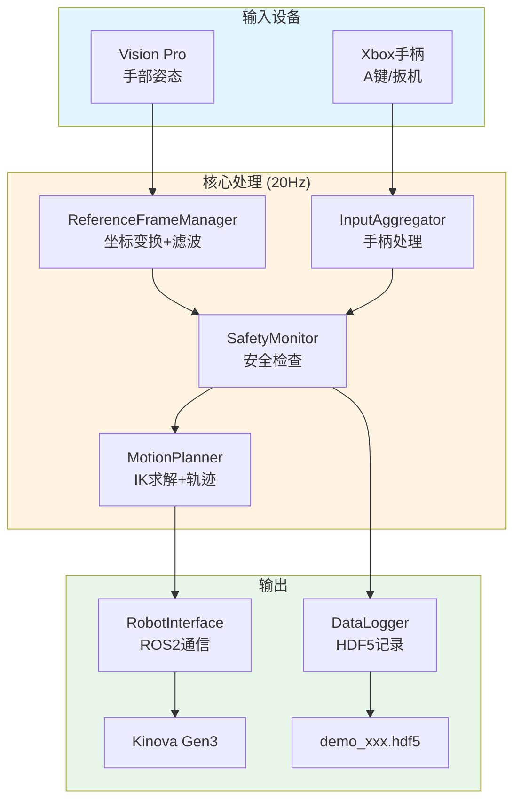
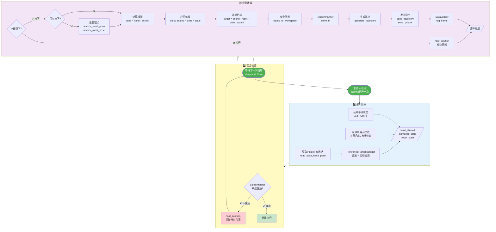
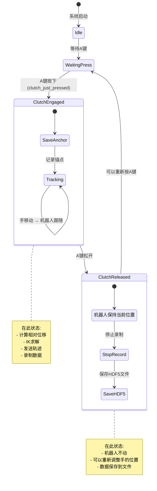
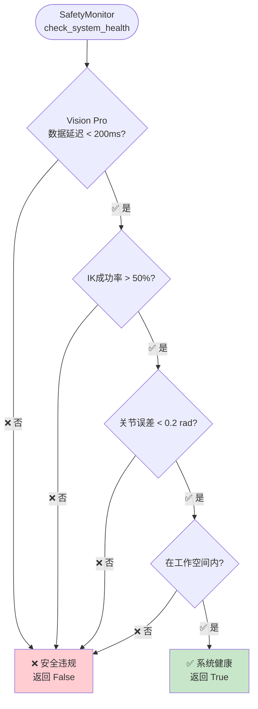
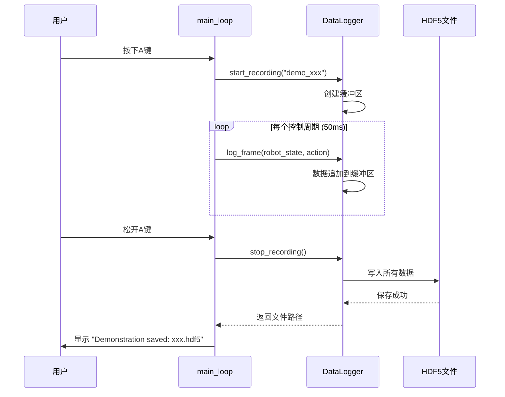
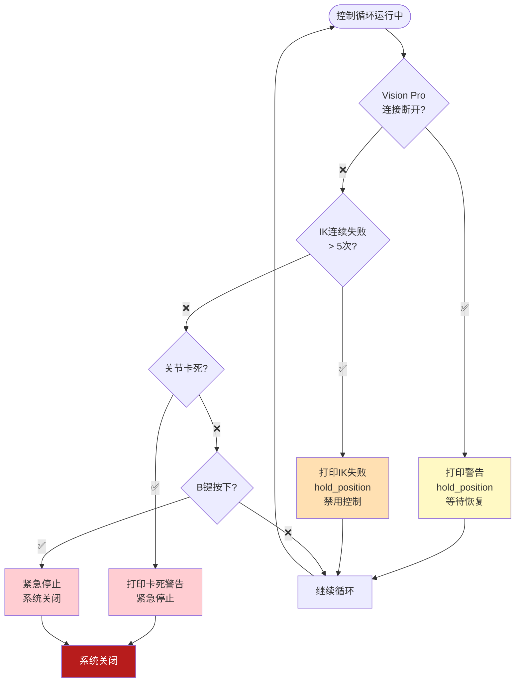
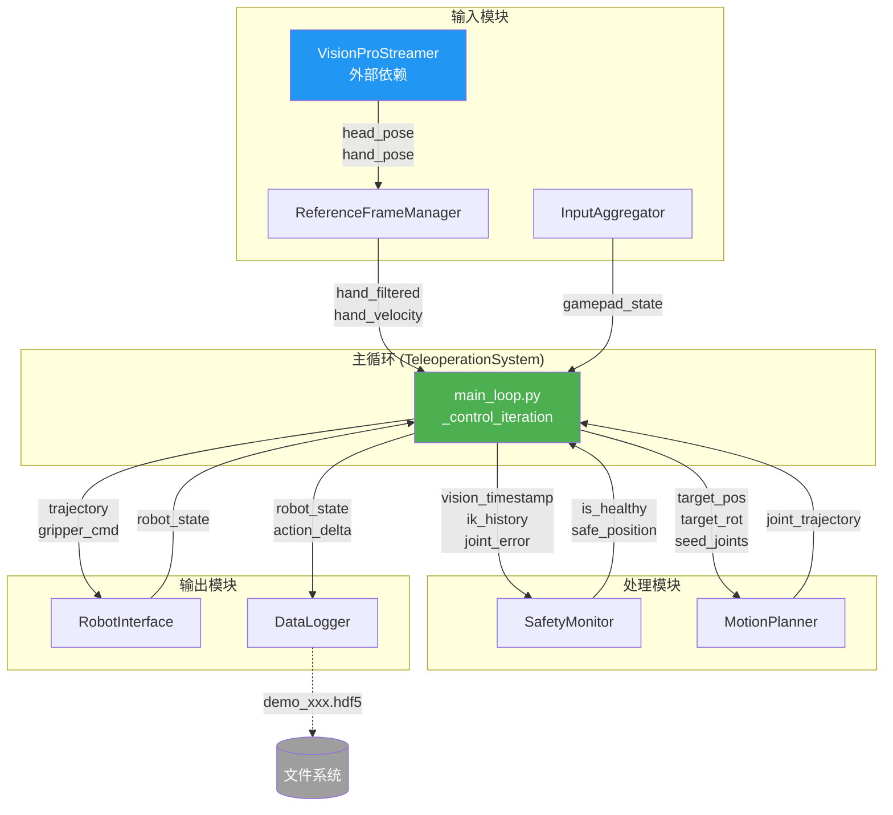
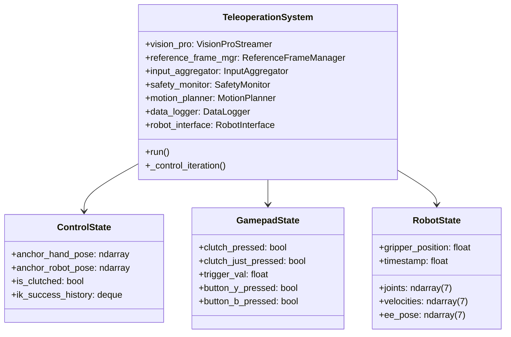

# Kinova 遥操作系统 - 控制流程图

> **用可视化图表理解整个系统** 📊

---

## 📌 系统总览



---

## 🔄 主循环详细流程 (20Hz)



---

## 🎯 Clutch (离合) 机制详解



---

## 🔐 安全监控逻辑



---

## 🎨 坐标变换流程

```mermaid
flowchart LR
    subgraph VisionPro["Vision Pro 输出"]
        Head[头部姿态<br/>T_head_world]
        Hand[手部姿态<br/>T_hand_head]
    end

    subgraph Transform["ReferenceFrameManager"]
        Calib[世界坐标校准<br/>T_world_calib]
        Multiply[矩阵乘法<br/>T_hand_world =<br/>T_world_calib *<br/>T_head_world *<br/>T_hand_head]
        Extract[提取位置<br/>[x, y, z]]
        Filter[OneEuroFilter<br/>平滑滤波]
    end

    subgraph Output["输出到控制器"]
        Filtered[hand_filtered<br/>[x, y, z]]
        Velocity[hand_velocity<br/>[vx, vy, vz]]
    end

    Head --> Calib
    Hand --> Calib
    Calib --> Multiply
    Multiply --> Extract
    Extract --> Filter
    Filter --> Filtered
    Filter --> Velocity

    style VisionPro fill:#E1F5FE
    style Transform fill:#FFF3E0
    style Output fill:#E8F5E9
```

---

## 📐 IK 求解与轨迹生成

```mermaid
flowchart TD
    Input[输入: 目标位置 + 姿态]

    subgraph IK["IK 求解 (MotionPlanner)"]
        Seed[准备种子关节角度<br/>当前关节配置]
        Solve[KDL IK求解器]
        Success{求解成功?}
        Joint[得到目标关节角度<br/>[j1...j7]]
        Fail[❌ IK失败<br/>hold_position]
    end

    subgraph Traj["轨迹生成"]
        Current[当前位置 P0]
        Predict1[预测 P1 = P0 + V*50ms]
        Predict2[预测 P2 = P0 + V*100ms]
        Predict3[预测 P3 = P0 + V*150ms]
        Window[生成3点轨迹窗口]
    end

    Output[JointTrajectory<br/>发送到机器人]

    Input --> IK
    Seed --> Solve
    Solve --> Success
    Success -->|✅| Joint
    Success -->|❌| Fail
    Joint --> Traj
    Current --> Predict1
    Predict1 --> Predict2
    Predict2 --> Predict3
    Predict3 --> Window
    Window --> Output

    style Fail fill:#FFCDD2
    style Output fill:#C8E6C9
```

---

## 💾 数据记录流程



---

## 🎮 手柄输入处理

```mermaid
flowchart TD
    Device[/dev/input/js0<br/>手柄设备]

    subgraph InputAggregator["InputAggregator"]
        Read[读取输入事件]
        Parse{解析事件类型}

        subgraph ButtonLogic["按键逻辑"]
            EdgeDetect[边缘检测<br/>just_pressed]
            StateUpdate[状态更新]
        end

        subgraph TriggerLogic["扳机逻辑"]
            Deadband[死区处理<br/>< 0.1 → 0]
            Normalize[归一化 0-1]
        end

        subgraph ScaleLogic["缩放逻辑"]
            YPress{Y键按下?}
            Toggle[切换模式]
            Fast[快速模式<br/>1.5x, 1.5x, 1.0x]
            Precise[精确模式<br/>0.5x, 0.5x, 0.5x]
        end
    end

    Output[GamepadState<br/>数据类]

    Device --> Read
    Read --> Parse
    Parse -->|按键| ButtonLogic
    Parse -->|扳机| TriggerLogic
    Parse -->|Y键| ScaleLogic

    ButtonLogic --> Output
    TriggerLogic --> Output

    YPress -->|✅| Toggle
    Toggle --> Fast
    Toggle --> Precise
    Fast --> Output
    Precise --> Output

    style Device fill:#E3F2FD
    style InputAggregator fill:#FFF9C4
    style Output fill:#E8F5E9
```

---

## 🚨 错误处理流程



---

## 🔄 模块间通信



---

## ⏱️ 时序分析 (单个控制周期)

```mermaid
gantt
    title 单个20Hz控制周期 (50ms)
    dateFormat X
    axisFormat %L ms

    section 感知
    Vision Pro获取 :0, 2
    手柄读取 :2, 1
    机器人状态 :3, 2
    坐标变换滤波 :5, 5

    section 决策
    安全检查 :10, 2
    计算目标位置 :12, 1
    工作空间限制 :13, 1

    section 规划
    IK求解 :14, 10
    轨迹生成 :24, 5

    section 执行
    发送指令 :29, 3
    数据记录 :32, 5

    section 等待
    Sleep :37, 13
```



**说明**:
- 总耗时: ~37ms
- 剩余时间: ~13ms (buffer)
- 如果超过50ms → 出现 "Loop overrun" 警告

---

## 📊 数据结构关系



---

## 🎓 总结

通过这些流程图，你应该能清楚地理解:

1. **数据流**: Vision Pro → 滤波 → 安全检查 → IK → 机器人
2. **控制流**: A键触发 → 计算增量 → 求解 → 执行
3. **安全流**: 多重检查 → 失败立即停止
4. **时序**: 20Hz主循环，每50ms一次

**核心理念**: 用相对位移控制，通过Clutch机制实现安全灵活的遥操作！

---

**提示**: 在GitHub上这些Mermaid图会自动渲染成可视化图表！
